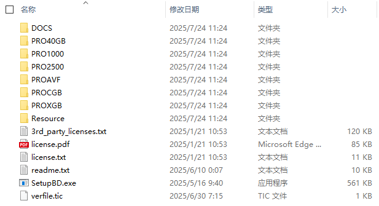
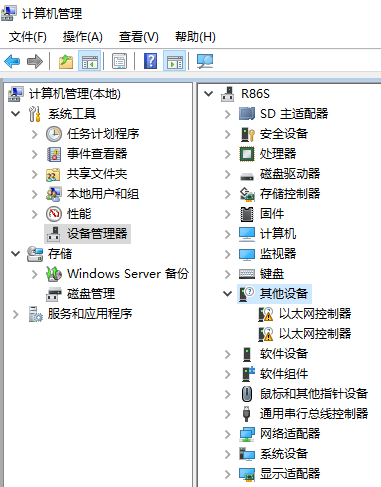
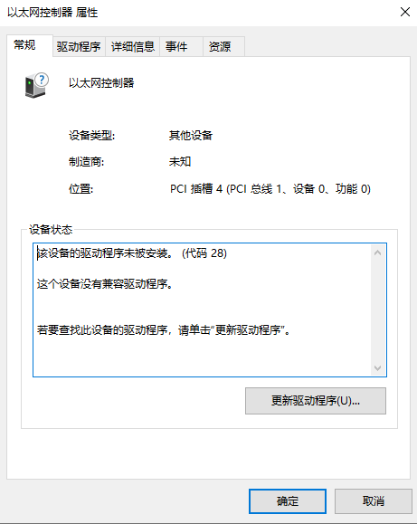
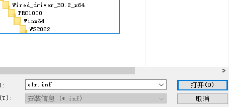

# 从intel官网下载驱动，除网卡驱动外直接解压安装
[网卡驱动](https://www.intel.cn/content/www/cn/zh/download/838943)

[显卡驱动](https://www.intel.cn/content/www/cn/zh/download/776137)

[英特尔® 管理引擎 驱动](https://www.intel.cn/content/www/cn/zh/download/682431)

[芯片组 INF 实用程序](https://www.intel.cn/content/www/cn/zh/download/19347)

> 还剩一个未知设备，硬件ID：`ACPI\VEN_INT&DEV_34C8`，不安装无影响，需要安装自行搜索`INT34C8`,或者直接用这个[驱动](Intel-FORCED-SerialIO-10x64-30.100.2133.4_JSL-drp.zip)

# 网卡驱动安装方法
1. 解压驱动，内容如图

2. CMD运行`compmgmt.msc`打开计算机管理

3. 找到`设备管理器`-`其他设备`，会显示三个带感叹号的`以太网控制器`

> 我这里已经安装了一个,所以只显示两个

4. 双击其中一个打开

5. 中间位置会显示`PCI插槽4`,`PCI插槽5`和`PCI插槽6`,分别对应物理接口的`ETH0`,`ETH1`和`ETH2`

6. `PCI插槽4`选择`更新驱动程序`，选择`浏览我的电脑以查找驱动程序`，选择`让我从计算机的可用驱动列表中选取`，选择`显示所有设备`，选择`下一步`，选择`从磁盘安装`，选择`浏览`，从解压路径找到`PRO1000/Winx64/WS2022/e1r.inf`打开,然后找到`Intel(R) I210 Gigabit Network Connection`，选择`下一步`，会弹出`不推荐安装警告`，选择`是`安装

7. `PCI插槽5和PCI插槽6`选择`PRO2500/Winx64/WS2022/e2f.inf`，然后找到`Intel(R) Ethernet Controller (3) I225-LM`,选择`下一步`，会弹出`不推荐安装警告`，选择`是`安装